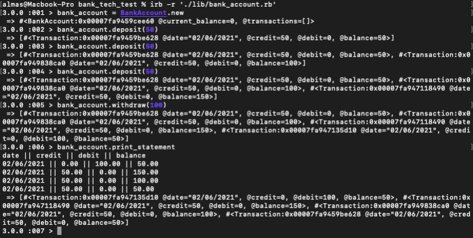

# Bank Tech Test - Solution

Welcome to my solution to the bank tech test.

## Objective

The object of this project was to create a program that records transactions in a bank account for customer and produces bank statament as and when required by the customer.

## User Stories and Domain Model

[Please follow this link to user stories and domain model.](https://docs.google.com/document/d/1Z-xaNT9Io60fmxJo41GX20VNreu6yiRZtL4UJEc9kt4/edit?usp=sharing)

## Stack and Implementation

The project has been written using ruby. The testing has been done in rspec. And rubocop has been used to ensure that everything is written in line with ruby conventions.

Project was written following a robust TDD process. Red, green, refactor cycle was observerd throughout. Test coverage is 100%.

## How to test and use

Please follow the instructions below to test this project:

- Clone this repo
- run the following commands to test in irb

```
bundle install
irb -r './lib/bank_account.rb' - to open irb requiring this project
bank_account = BankAccount.new
bank_account.deposit(value) - to add funds
bank_account.deposit(value) - to withdraw funds
bank_account.print_statment - to print bank statment
```

- You can run the test by entering rspec

## Feature test



## Conclusion

This was an extremely enjoyable project to complete. I am looking forward to doing more of these for during the job hunting process.
